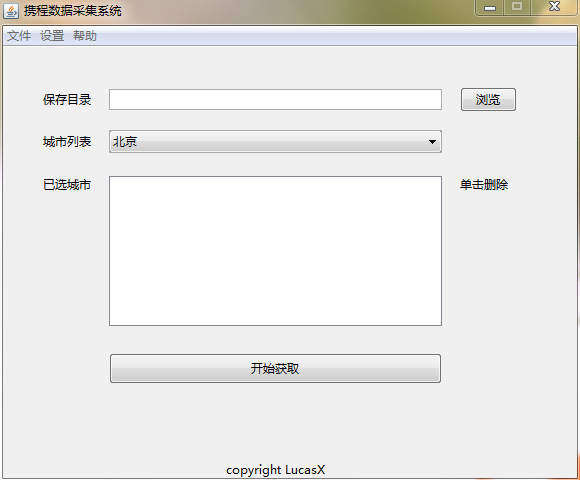

# Ctrip Web Crawler

## Introduction
A web crawler based on Java8 with GUI.

## Prerequisite
* __Java8__
* Maven

## How to use
1. clone this repository from [github](https://github.com/EclipseXuLu/CtripPro.git)
2. run [MainJFrame](src/main/java/com/ctrip/spider/MainJFrame.java) to show you a GUI
3. you can choose the data folder and the cities you want to crawl
4. multi-thread is set by default, you can choose to close it by deselecting at __settings__ menu 